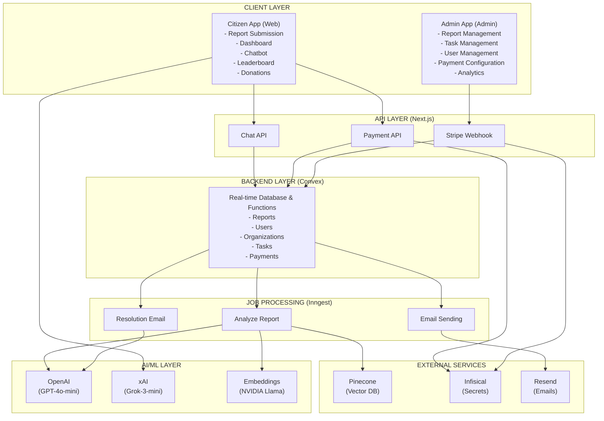
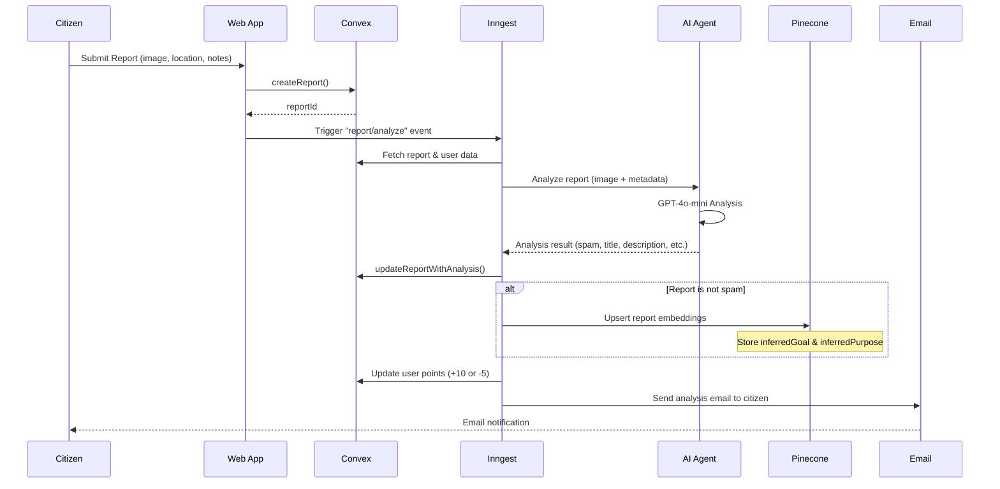
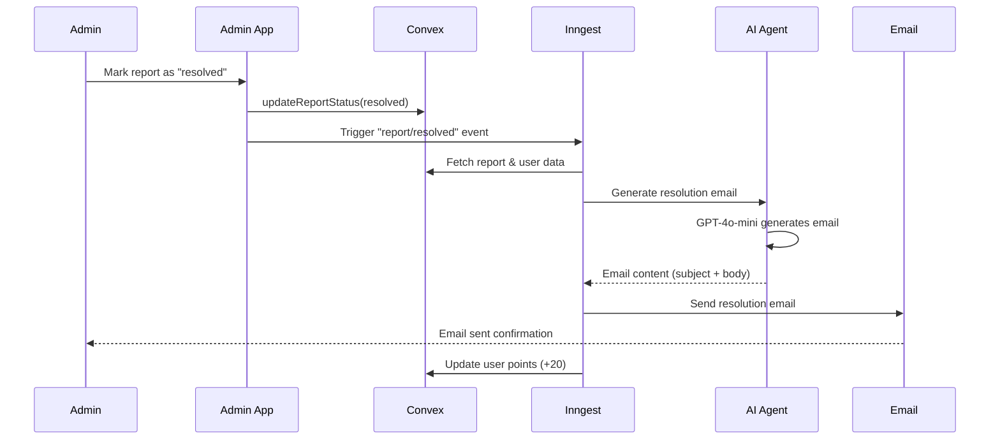
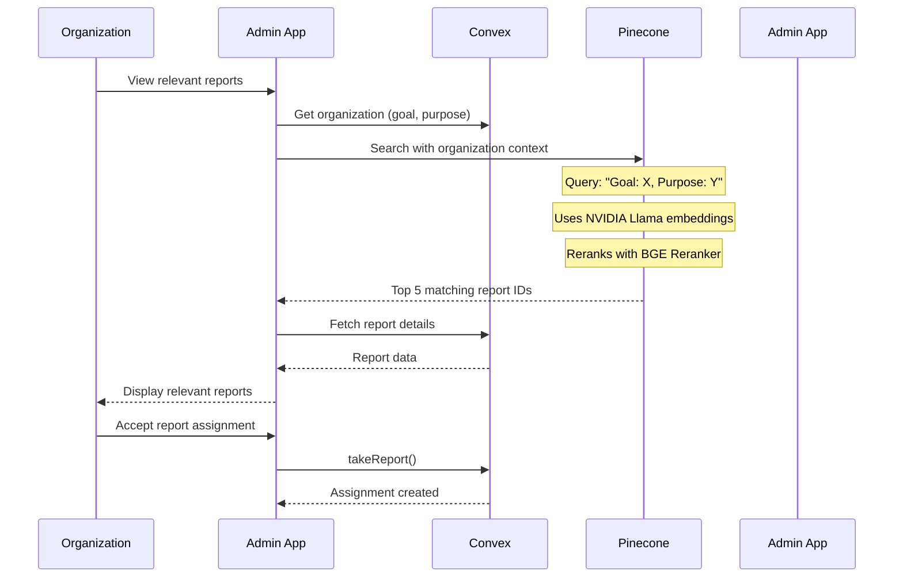
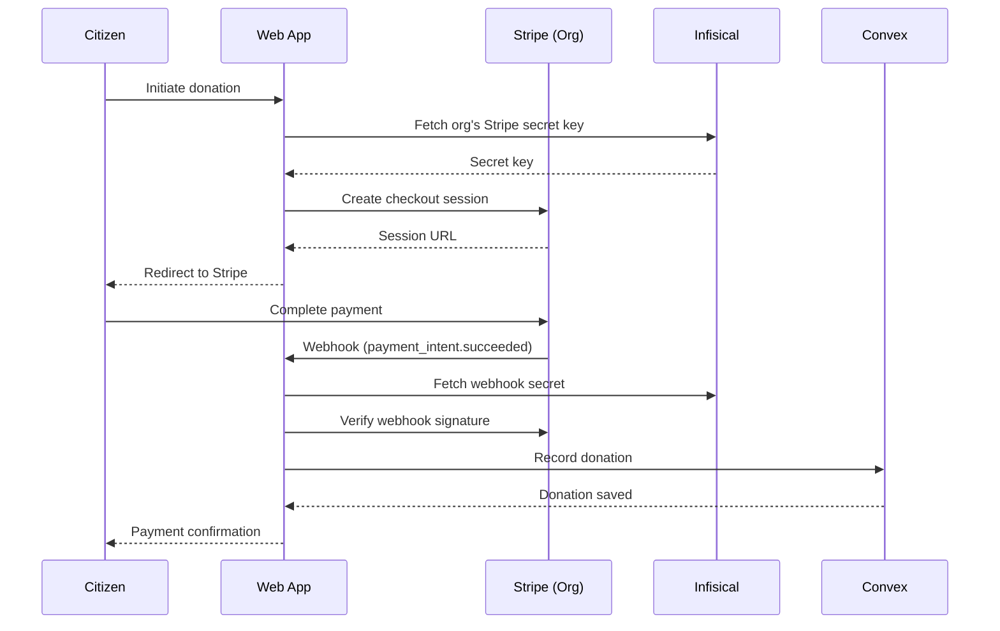
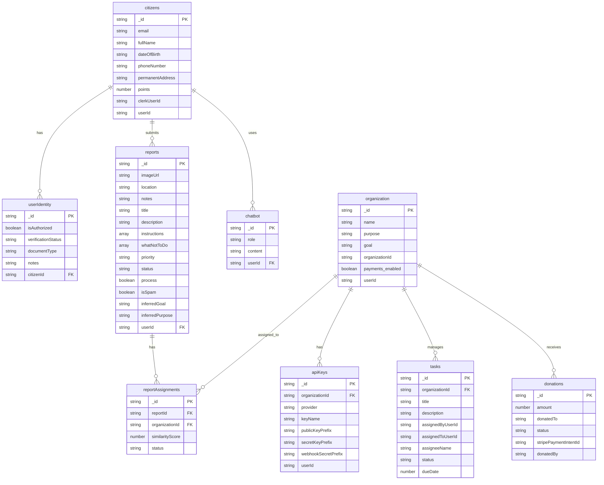

# Urban Watch

A comprehensive smart city civic engagement platform that enables citizens to report urban issues, organizations to manage and resolve them, and AI-powered analysis to streamline the entire process.

## 📋 Table of Contents

- [Overview](#overview)
- [Tech Stack](#tech-stack)
- [Project Structure](#project-structure)
- [Architecture](#architecture)
- [Application Flow](#application-flow)
- [Database Schema (ER Diagram)](#database-schema-er-diagram)
- [AI Agent Architecture](#ai-agent-architecture)
- [Bring Your Own Stripe (BYOS) Implementation](#bring-your-own-stripe-byos-implementation)
- [Vector Database & Embeddings](#vector-database--embeddings)
- [Getting Started](#getting-started)
- [Environment Variables](#environment-variables)
- [Deployment](#deployment)

## 🎯 Overview

Urban Watch is a full-stack civic engagement platform that bridges the gap between citizens and organizations working to improve urban infrastructure. The platform features:

- **Citizen Portal**: Submit reports, track status, earn points, view leaderboard, and chat with other citizens
- **Admin Portal**: Organizations can manage reports, assign tasks, enable payments, and track progress
- **AI-Powered Analysis**: Automatic report analysis, spam detection, and intelligent report-to-organization matching
- **Payment Integration**: Bring Your Own Stripe (BYOS) implementation for organizations to accept donations
- **Vector Search**: Semantic search using Pinecone to match reports with relevant organizations

## 🛠 Tech Stack

### Frontend
- **Framework**: Next.js 16 (App Router)
- **UI Library**: React 19
- **Styling**: Tailwind CSS 4
- **UI Components**: Radix UI + shadcn/ui
- **State Management**: Convex (real-time)
- **Authentication**: Clerk
- **Forms**: React Hook Form + Zod
- **Chat**: Stream Chat
- **Payments**: Stripe.js

### Backend
- **Database**: Convex (serverless backend)
- **Job Queue**: Inngest
- **Email Service**: Resend
- **Vector Database**: Pinecone
- **Embedding Model**: NVIDIA Llama-text-embedd-v2
- **Reranking**: BGE Reranker v2-m3

### AI/ML
- **LLM Provider**: OpenAI (GPT-4o-mini) for report analysis
- **Chatbot**: xAI (Grok-3-mini)
- **AI SDK**: Vercel AI SDK

### Infrastructure
- **Monorepo**: Turborepo
- **Package Manager**: pnpm
- **Secret Management**: Infisical (AWS Credential Manager compatible)
- **Deployment**: Vercel (presumed)

### Development Tools
- **TypeScript**: 5.7+
- **Linting**: ESLint
- **Code Formatting**: Prettier

## 📁 Project Structure

```
urban-watch/
├── apps/
│   ├── web/                    # Citizen-facing application
│   │   ├── app/                 # Next.js app router
│   │   │   ├── (auth)/         # Authentication routes
│   │   │   ├── (dashboard)/    # Protected dashboard routes
│   │   │   │   ├── reports/    # Report management
│   │   │   │   ├── submit-report/
│   │   │   │   ├── chatbot/    # AI assistant
│   │   │   │   ├── chat/       # User-to-user chat
│   │   │   │   ├── donate/     # Donation flow
│   │   │   │   └── verify-account/
│   │   │   └── api/            # API routes
│   │   │       ├── chat/       # Chatbot API
│   │   │       ├── payments/   # Payment creation
│   │   │       └── stripe/     # Stripe webhooks
│   │   ├── components/         # Shared components
│   │   ├── modules/            # Feature modules
│   │   └── lib/                # Utilities
│   │
│   └── admin/                  # Organization-facing application
│       ├── app/
│       │   ├── (auth)/         # Authentication
│       │   ├── (dashboard)/    # Admin dashboard
│       │   │   ├── reports/    # Report management
│       │   │   ├── my-reports/ # Organization's reports
│       │   │   ├── users/      # User management
│       │   │   ├── my-tasks/   # Task management
│       │   │   └── payments/   # Stripe configuration
│       │   └── api/
│       │       └── secrets/    # Secret management
│       └── modules/             # Feature modules
│
├── packages/
│   ├── backend/                # Convex backend
│   │   └── convex/
│   │       ├── functions/      # Convex functions
│   │       │   ├── reports.ts
│   │       │   ├── users.ts
│   │       │   ├── organizations.ts
│   │       │   ├── tasks.ts
│   │       │   ├── payments.ts
│   │       │   ├── chatbot.ts
│   │       │   └── verification.ts
│   │       ├── schema.ts       # Database schema
│   │       └── auth.config.ts  # Auth configuration
│   │
│   ├── jobs/                   # Inngest job functions
│   │   └── inngest/
│   │       ├── functions/      # Job definitions
│   │       │   ├── analyze-report.ts
│   │       │   ├── report-resolution.ts
│   │       │   ├── send-email.ts
│   │       │   └── verify-account.ts
│   │       ├── vercel/
│   │       │   ├── agents/     # AI agents
│   │       │   │   ├── analyze-report.ts
│   │       │   │   ├── generate-resolution-email.ts
│   │       │   │   └── verify-account.ts
│   │       │   └── prompts/    # AI prompts
│   │       └── vectors/
│   │           └── pinecone.ts  # Pinecone client
│   │
│   ├── emails/                 # Email templates
│   │   └── src/
│   │       ├── report-analysis.ts
│   │       ├── verify-account.ts
│   │       └── send-email.ts
│   │
│   └── ui/                     # Shared UI components
│       └── src/
│           ├── components/     # Reusable components
│           └── lib/            # Utilities
│
├── package.json
├── turbo.json                  # Turborepo configuration
├── pnpm-workspace.yaml
└── tsconfig.json
```

## 🏗 Architecture

### System Architecture Diagram



## 🔄 Application Flow

### Report Submission & Analysis Flow



### Report Resolution Flow



### Organization Report Matching Flow



### Payment Flow (BYOS)



## 📊 Database Schema (ER Diagram)



## 🤖 AI Agent Architecture

### Report Analysis Agent

```
┌─────────────────────────────────────────────────────────────────┐
│                    REPORT ANALYSIS AGENT                         │
└─────────────────────────────────────────────────────────────────┘

Input:
  ├── Image URL (uploaded report image)
  ├── Location (geographic coordinates/address)
  └── Notes (citizen's description)

Processing Pipeline:
  │
  ├─► [Vision Analysis]
  │   └─► GPT-4o-mini with image understanding
  │       ├─► Spam Detection
  │       ├─► Issue Classification
  │       └─► Context Extraction
  │
  ├─► [Structured Output Generation]
  │   └─► Zod Schema Validation
  │       ├─► isSpam: boolean
  │       ├─► title: string | null
  │       ├─► description: string | null
  │       ├─► instructions: string[] | null
  │       ├─► whatNotToDo: string[] | null
  │       ├─► priority: "low" | "medium" | "high" | null
  │       ├─► inferredGoal: string | null
  │       ├─► inferredPurpose: string | null
  │       └─► email: { subject, body }
  │
  └─► [Post-Processing]
      ├─► Update Convex database
      ├─► Upsert to Pinecone (if not spam)
      ├─► Update user points
      └─► Send email notification

Output:
  └─► Structured report data + metadata
```

### Chatbot Agent

```
┌─────────────────────────────────────────────────────────────────┐
│                      CHATBOT AGENT                              │
└─────────────────────────────────────────────────────────────────┘

Model: xAI Grok-3-mini
System Prompt: Urban Watch assistant guidelines

Capabilities:
  ├── Feature explanations
  ├── Report workflow guidance
  ├── Points system information
  ├── Leaderboard queries
  └── Civic engagement best practices

Guardrails:
  ├── Scope limited to Urban Watch features
  ├── No political/legal/medical advice
  ├── No emergency response
  └── Redirects out-of-scope questions
```

### Vector Search Agent

```
┌─────────────────────────────────────────────────────────────────┐
│                    VECTOR SEARCH AGENT                           │
└─────────────────────────────────────────────────────────────────┘

Embedding Model: NVIDIA Llama-text-embedd-v2
Vector Database: Pinecone
Reranking Model: BGE Reranker v2-m3

Process:
  1. Organization defines goal & purpose
  2. Query: "Goal: {goal}, Purpose: {purpose}"
  3. Embed query using NVIDIA Llama-text-embedd-v2
  4. Search Pinecone index (topK=5)
  5. Rerank results using BGE Reranker
  6. Return top matching reports

Indexed Fields:
  ├── inferredGoal
  ├── inferredPurpose
  └── text (concatenated goal + purpose)
```

## 💳 Bring Your Own Stripe (BYOS) Implementation

### Architecture Overview

Urban Watch implements a multi-tenant Stripe integration where each organization brings their own Stripe account. This allows organizations to:
- Use their own Stripe account and payment processing
- Maintain full control over their payment data
- Receive payments directly to their account
- Configure their own webhooks

### Implementation Details

#### 1. Secret Storage (Infisical)

Organizations store their Stripe credentials securely using **Infisical** (AWS Credential Manager compatible):

```
Secret Naming Convention:
  - tenant_public_{organizationId}  → Stripe publishable key
  - tenant_secret_{organizationId}  → Stripe secret key
  - tenant_webhook_{organizationId}  → Stripe webhook secret
```

**Storage Flow:**
```
Admin → API Route → Infisical SDK → Create Secrets
  └─► Only key prefixes stored in Convex (for display)
  └─► Full keys stored securely in Infisical
```

#### 2. Payment Creation Flow

```typescript
// 1. Fetch organization's Stripe secret from Infisical
const secretKey = await infisical.getSecret(`tenant_secret_${orgId}`);

// 2. Initialize Stripe with organization's key
const stripe = new Stripe(secretKey.secretValue);

// 3. Create checkout session
const session = await stripe.checkout.sessions.create({
  payment_method_types: ["card"],
  line_items: [...],
  mode: "payment",
  metadata: { organizationId, userId }
});
```

#### 3. Webhook Processing

```typescript
// 1. Receive webhook from Stripe
// 2. Extract organizationId from metadata
// 3. Fetch organization's webhook secret from Infisical
const webhookSecret = await infisical.getSecret(`tenant_webhook_${orgId}`);

// 4. Verify webhook signature
stripe.webhooks.constructEvent(body, signature, webhookSecret);

// 5. Process payment event
// 6. Update Convex database
```

#### 4. Security Features

- **Tenant Isolation**: Each organization's keys are isolated
- **Key Prefix Storage**: Only first 9 characters stored in Convex (for display)
- **Secure Retrieval**: Keys fetched from Infisical only when needed
- **Webhook Verification**: Each webhook verified with organization-specific secret

### Configuration UI

Organizations can:
- Add Stripe keys through admin dashboard
- View key prefixes (for verification)
- Delete keys (removes from both Convex and Infisical)
- Enable/disable payments

## 🔍 Vector Database & Embeddings

### Pinecone Configuration

- **Index Name**: `urban-watch-admin`
- **Namespace**: `default`
- **Embedding Model**: NVIDIA Llama-text-embedd-v2
- **Reranking Model**: BGE Reranker v2-m3

### Embedding Process

1. **Report Analysis**: When a report is analyzed and determined to be legitimate:
   ```typescript
   const record = {
     id: reportId,
     text: `Inferred Goal: ${inferredGoal}, Inferred Purpose: ${inferredPurpose}`,
     inferredGoal: inferredGoal,
     inferredPurpose: inferredPurpose
   };
   await index.upsertRecords([record]);
   ```

2. **Vector Generation**: Pinecone automatically generates embeddings using NVIDIA Llama-text-embedd-v2 when upserting records.

3. **Search Process**:
   ```typescript
   const query = `Goal: ${orgGoal}, Purpose: ${orgPurpose}`;
   const results = await index.searchRecords({
     query: {
       topK: 5,
       inputs: { text: query }
     },
     rerank: {
       model: "bge-reranker-v2-m3",
       topN: 5,
       rankFields: ["text"]
     },
     fields: ["inferredGoal", "inferredPurpose"]
   });
   ```

### Use Cases

- **Report Matching**: Match reports to organizations based on semantic similarity
- **Relevant Reports**: Organizations see reports aligned with their goals
- **Semantic Search**: Natural language queries for finding relevant issues

## 🚀 Getting Started

### Prerequisites

- Node.js >= 20
- pnpm >= 10.4.1
- Convex account
- Clerk account
- Pinecone account
- Infisical account (or AWS Credential Manager)
- OpenAI API key
- xAI API key
- Resend API key

### Installation

```bash
# Clone the repository
git clone <repository-url>
cd urban-watch

# Install dependencies
pnpm install

# Set up Convex
cd packages/backend
pnpm dev  # Follow prompts to set up Convex
```

### Development

```bash
# Start all apps in development mode
pnpm dev

# Start specific app
pnpm --filter web dev
pnpm --filter admin dev

# Start Inngest dev server
cd packages/jobs
pnpm dev
```

## 🔐 Environment Variables

### Web App (`apps/web/.env.local`)

```env
# Clerk
NEXT_PUBLIC_CLERK_PUBLISHABLE_KEY=
CLERK_SECRET_KEY=
CLERK_JWT_ISSUER_DOMAIN_WEB=

# Convex
NEXT_PUBLIC_CONVEX_URL=
CONVEX_DEPLOYMENT_KEY=

# Infisical (Secret Management)
MACHINE_ID=
MACHINE_SECRET=
PROJECT_ID=

# Inngest
INNGEST_EVENT_KEY=
INNGEST_SIGNING_KEY=

# Stream Chat
NEXT_PUBLIC_STREAM_KEY=
STREAM_SECRET=

# xAI (Chatbot)
XAI_API_KEY=
```

### Admin App (`apps/admin/.env.local`)

```env
# Clerk
NEXT_PUBLIC_CLERK_PUBLISHABLE_KEY=
CLERK_SECRET_KEY=
CLERK_JWT_ISSUER_DOMAIN_ADMIN=

# Convex
NEXT_PUBLIC_CONVEX_URL=
CONVEX_DEPLOYMENT_KEY=

# Infisical
MACHINE_ID=
MACHINE_SECRET=
PROJECT_ID=

# Inngest
INNGEST_EVENT_KEY=
INNGEST_SIGNING_KEY=
```

### Backend (`packages/backend/.env`)

```env
# Convex
CONVEX_DEPLOYMENT_KEY=

# Clerk
CLERK_JWT_ISSUER_DOMAIN_WEB=
CLERK_JWT_ISSUER_DOMAIN_ADMIN=
CLERK_SECRET_KEY=
```

### Jobs (`packages/jobs/.env`)

```env
# OpenAI
OPENAI_API_KEY=

# Pinecone
PINECONE_API_KEY=

# Convex
CONVEX_URL=
CONVEX_DEPLOYMENT_KEY=

# Resend
RESEND_API_KEY=
```

## 📦 Deployment

### Build

```bash
pnpm build
```

### Deploy

1. **Convex**: Deploy backend functions
   ```bash
   cd packages/backend
   npx convex deploy
   ```

2. **Vercel**: Deploy Next.js apps
   - Connect repository to Vercel
   - Configure environment variables
   - Deploy web and admin apps

3. **Inngest**: Deploy job functions
   - Configure Inngest in Vercel
   - Set up event triggers

4. **Pinecone**: Create index
   - Index name: `urban-watch-admin`
   - Configure embedding model: NVIDIA Llama-text-embedd-v2

## 📝 Key Features

### For Citizens
- ✅ Submit urban issue reports with images
- ✅ Track report status in real-time
- ✅ Earn points for quality reports
- ✅ View leaderboard rankings
- ✅ Chat with other citizens
- ✅ AI-powered assistant for guidance
- ✅ Donate to organizations

### For Organizations
- ✅ View and manage reports
- ✅ Semantic search for relevant reports
- ✅ Task management (Kanban & Calendar views)
- ✅ User management
- ✅ Bring Your Own Stripe integration
- ✅ Analytics and reporting
- ✅ Email notifications

### AI Features
- ✅ Automatic spam detection
- ✅ Report analysis and categorization
- ✅ Priority assignment
- ✅ Semantic report matching
- ✅ Resolution email generation
- ✅ Account verification assistance

## 🔒 Security

- **Authentication**: Clerk-based authentication with JWT
- **Authorization**: Role-based access control (admin/member)
- **Secret Management**: Infisical for secure credential storage
- **Webhook Verification**: Stripe webhook signature validation
- **Data Isolation**: Organization-scoped data access
- **Input Validation**: Zod schema validation throughout

## 📄 License

[Your License Here]

## 🤝 Contributing

[Contributing Guidelines]

## 📧 Contact

[Contact Information]

---

**Built with ❤️ for smarter cities**
