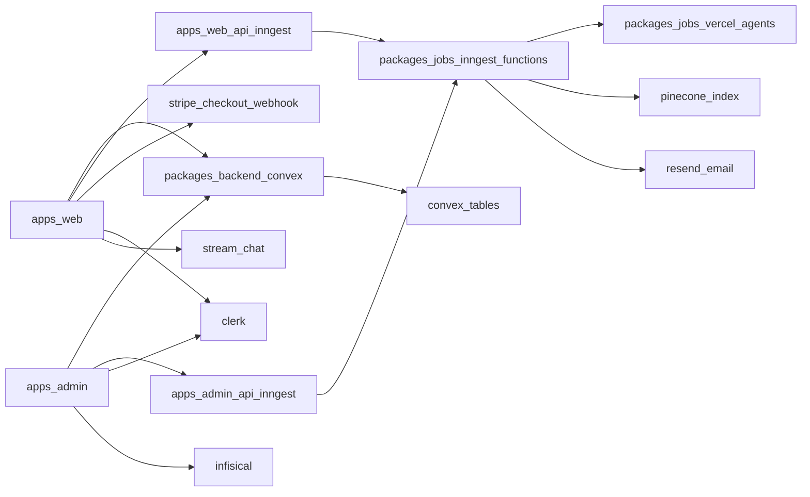

# Architecture Overview

Urban Watch is a pnpm + Turborepo monorepo with two Next.js apps and shared packages for backend, workflows, UI, and email.

## Top-Level Runtime Model

## Repo Surfaces

- Apps:
  - `apps/web`: citizen app (reports, verification, donation, chatbot, chat)
  - `apps/admin`: organization app (report triage, tasks, users, payments, onboarding)
- Packages:
  - `packages/backend`: Convex schema and API logic
  - `packages/jobs`: Inngest clients, functions, AI agents, vector tooling
  - `packages/ui`: shared components/hooks/styles
  - `packages/emails`: Resend email senders/templates
  - `packages/eslint-config`, `packages/typescript-config`: shared tooling config

## Core Data and Workflow Paths

1. User actions in apps call Convex via generated API (`@workspace/backend/convex/_generated/api`).
2. Server actions/routes emit Inngest events through either `inngestWeb` or `inngestAdmin`.
3. Inngest functions read/write Convex and call external systems (OpenAI/xAI, Pinecone, Resend).
4. Convex remains the system of record for app domain data.

## App Responsibilities at a Glance

- `apps/web`
  - citizen onboarding and account verification trigger
  - report submission and analysis initiation
  - donation checkout and webhook-driven payment status updates
  - chatbot interactions with persisted assistant responses
- `apps/admin`
  - organization onboarding and profile completion gate
  - report intake and assignment handling
  - report resolution and user communications
  - org task management and user admin actions

## Source Files

- Workspace and tasks: `pnpm-workspace.yaml`, `turbo.json`, `package.json`
- Convex: `packages/backend/convex`
- Inngest + agents: `packages/jobs/inngest`
- App API entrypoints: `apps/web/app/api`, `apps/admin/app/api`
